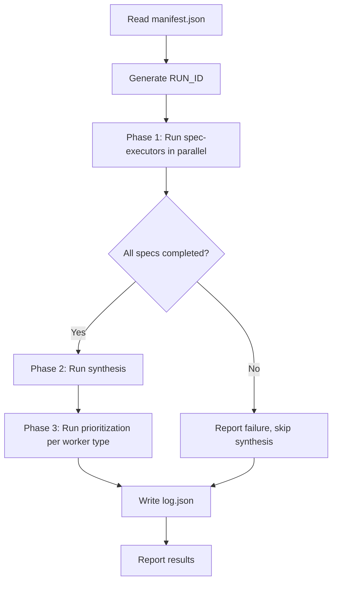

# Run Agents

Runs the agent-based extraction pipeline: spawns Claude Code subagents for spec execution → synthesis → prioritization.

> **Not to be confused with `npm run extract`** in `workers/extraction/`, which is the TypeScript extraction worker. This command uses Claude Code subagents; the TS worker is a single-process CLI.

## Arguments

$ARGUMENTS - Format: `<folder> <tenant-env>`

- **folder**: Spec folder name (e.g., `weekly-focus-queue`, `99-dev-test`)
- **tenant-env**: Tenant and environment as `{tenant}-{env}` (e.g., `helpinghands-local`)

Example: `/run-agents weekly-focus-queue helpinghands-local`

## Environments

| Environment | MCP Endpoint | Secrets File |
|-------------|--------------|--------------|
| `local` | `http://localhost:8787/mcp` | `secrets.local` |
| `develop` | `https://{tenant}-dev.joebouchard.workers.dev/mcp` | `secrets.develop` |
| `production` | `https://{tenant}-prod.joebouchard.workers.dev/mcp` | `secrets.production` |

## What This Command Does



## Execution

This command delegates to `/run-specs` which handles the full extraction workflow.

**Run**: `/run-specs $ARGUMENTS`

The run-specs skill contains the detailed implementation for:
1. Reading the manifest
2. Spawning parallel spec-executor agents
3. Gate checking (all specs must pass for synthesis)
4. Running synthesis-executor
5. Running prioritization for each worker type
6. Writing execution log (log.json)

## Output Structure

```
dat/{tenant}/raw/{folder}/{RUN_ID}/
├── 01-*.json, 01-*.md          # Spec outputs
├── 02-*.json, 02-*.md
├── ...
├── 99-synthesis.json, .md       # Executive summary
├── 100-prioritization-*.json, .md  # Role-specific action plans
└── log.json                     # Execution metadata
```

## Next Steps

After extraction completes:
1. `/run-enrich {tenant}` - Run Python enrichment pipeline
2. `/run-sync {tenant}` - Sync to R2 storage

Or run both with the CLI: `./scripts/devops/cli pipeline {tenant}`

## Example Usage

```
# Local development (requires MCP server running)
/run-agents 99-dev-test helpinghands-local

# Production
/run-agents weekly-focus-queue helpinghands-production
```
