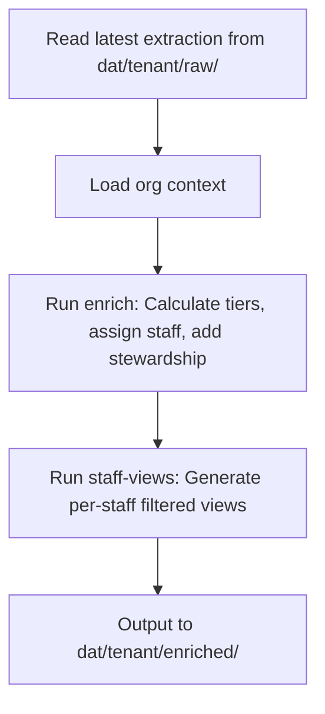

# Run Enrich

Runs the Python enrichment pipeline to contextualize extraction data with organizational policy.

## Arguments

$ARGUMENTS - Format: `<tenant>`

- **tenant**: Organization identifier (e.g., `helpinghands`)

Example: `/run-enrich helpinghands`

## What This Command Does



## Execution Steps

### Step 1: Validate Prerequisites

Check that extraction data exists:
```bash
ls dat/{tenant}/raw/*/
```

Check that org context exists:
```bash
ls prioritize/org/{tenant}-org-context.json
```

### Step 2: Run Enrichment

```bash
cd prioritize && uv run enrich --org {tenant}
```

This command:
- Loads org context from `prioritize/org/{tenant}-org-context.json`
- Finds the **latest** workflow run in `dat/{tenant}/raw/weekly-focus-queue/`
- Calculates donor tiers based on lifetime giving
- Assigns staff based on tier-to-role mapping
- Adds stewardship requirements (touches/year, acknowledgment deadlines)
- Outputs to `dat/{tenant}/enriched/dashboard-data.json`

### Step 3: Generate Staff Views

```bash
cd prioritize && uv run staff-views --org {tenant}
```

This command:
- Reads `dat/{tenant}/enriched/dashboard-data.json`
- Filters candidates by staff portfolio
- Outputs per-staff JSON files to `dat/{tenant}/enriched/staff/`

### Step 4: Report Results

List the generated files:
```bash
ls -la dat/{tenant}/enriched/
ls -la dat/{tenant}/enriched/staff/
```

## Output Structure

```
dat/{tenant}/enriched/
├── dashboard-data.json          # Full enriched data with aggregations
└── staff/
    ├── {staff-name}.json        # Filtered view for each staff member
    └── ...
```

## Enrichment Logic

| Field | Source | Description |
|-------|--------|-------------|
| `donor_tier` | Lifetime giving | Major ($10K+), Mid-Level ($1K+), Annual Fund |
| `assigned_staff_name` | Tier mapping | ED → Major, DD → Mid-Level, Coordinator → Annual |
| `stewardship_touches` | Org policy | Required touches per year by tier |
| `acknowledgment_deadline` | Org policy | Days to acknowledge by tier |

## Prerequisites

- Extraction data in `dat/{tenant}/raw/`
- Org context in `prioritize/org/{tenant}-org-context.json`
- Python environment: `cd prioritize && uv sync`

## Next Steps

After enrichment completes:
- `/run-sync {tenant}` - Sync to R2 storage

## Example Usage

```
# After running extraction
/run-enrich helpinghands

# Check results
ls dat/helpinghands/enriched/
```
