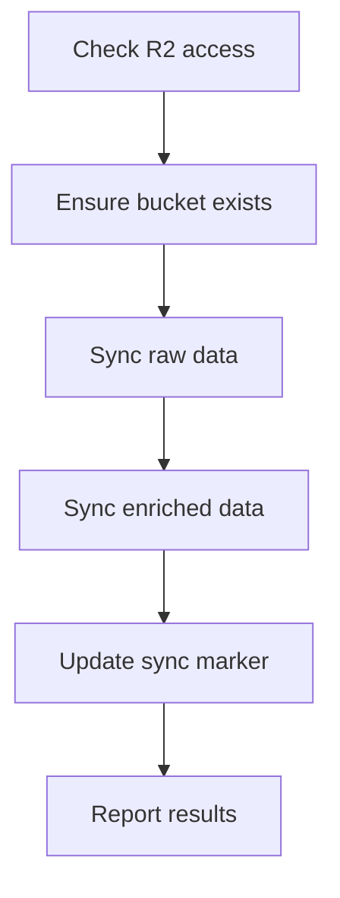

# Run Sync

Syncs tenant data (raw + enriched) to Cloudflare R2 storage.

## Arguments

$ARGUMENTS - Format: `<tenant> [--dry-run]`

- **tenant**: Organization identifier (e.g., `helpinghands`)
- **--dry-run**: Preview what would be uploaded without actually uploading

Example: `/run-sync helpinghands`

## What This Command Does



## Execution Steps

### Step 1: Setup Environment

Source the sync library and check R2 access:
```bash
cd /Users/mpaz/workspace/joe/resin-platform
source scripts/devops/lib/common.sh
source scripts/devops/lib/sync/r2.sh
```

### Step 2: Check R2 Access

Verify Cloudflare R2 is configured:
```bash
# This requires ~/.cloudflare/joe-token to exist
check_r2_ready
```

### Step 3: Sync Data

For the full sync, run via the CLI:
```bash
./scripts/devops/cli sync all {tenant}
```

Or for dry-run:
```bash
./scripts/devops/cli sync all {tenant} --dry-run
```

### Step 4: Report Results

The sync command will report:
- Number of files uploaded
- Number of files skipped (unchanged since last sync)
- Any failures

## R2 Structure

```
resin-{tenant}-data/           # Bucket per tenant
├── raw/                       # Extraction outputs
│   └── {folder}/{RUN_ID}/
│       ├── *.json
│       └── *.md
└── enriched/                  # Enriched data
    ├── dashboard-data.json
    └── staff/*.json
```

## Incremental Sync

The sync is **incremental** - only files newer than the last sync marker are uploaded.

- Marker file: `dat/{tenant}/.last-sync`
- First sync uploads everything
- Subsequent syncs only upload changed files

## Prerequisites

- Cloudflare API token in `~/.cloudflare/joe-token`
- R2 enabled on Cloudflare account
- Data in `dat/{tenant}/raw/` and/or `dat/{tenant}/enriched/`

## Sync Subcommands

| Command | Description |
|---------|-------------|
| `sync all {tenant}` | Sync both raw and enriched |
| `sync raw {tenant}` | Sync only raw extraction data |
| `sync enriched {tenant}` | Sync only enriched data |

## Example Usage

```
# Preview what would be synced
/run-sync helpinghands --dry-run

# Sync all data
/run-sync helpinghands

# Check sync status
./scripts/devops/cli sync status
```

## Troubleshooting

| Issue | Solution |
|-------|----------|
| "R2 not enabled" | Enable R2 in Cloudflare dashboard |
| "Multiple accounts" | Ensure `~/.cloudflare/joe-token` exists |
| "Bucket not found" | Will be created automatically |
