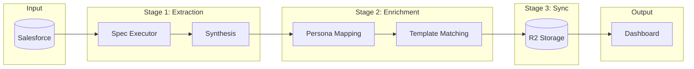
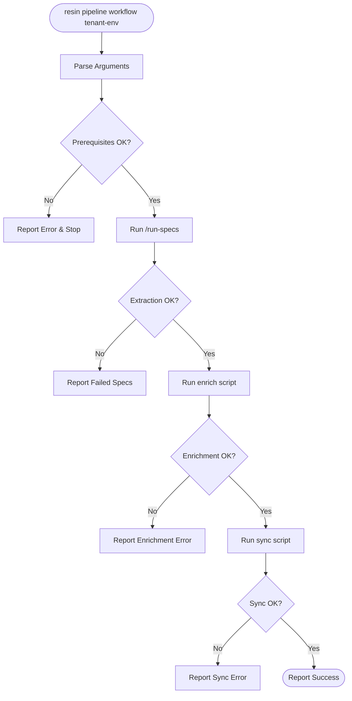
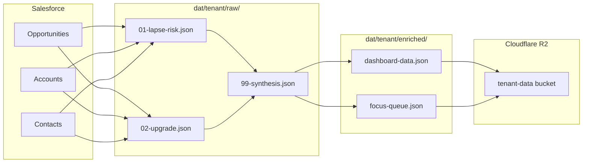
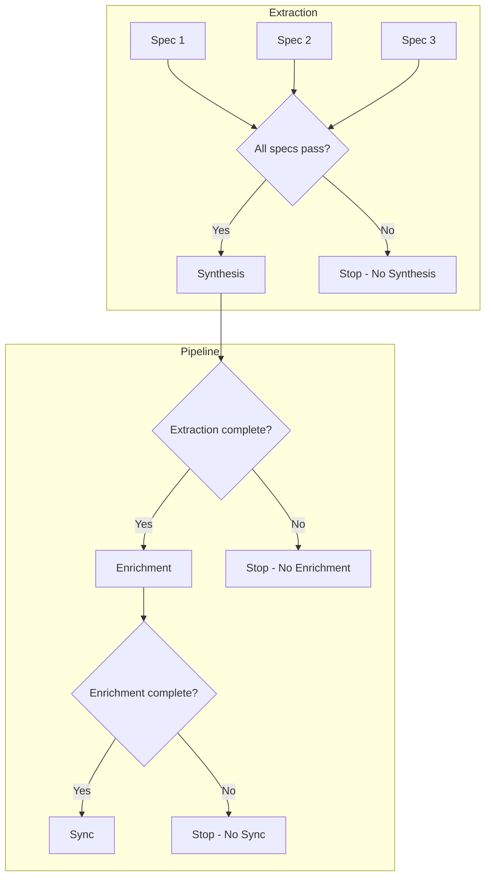

# Execution Flow Diagrams

## High-Level Pipeline



## Pipeline Execution Flow



## Data Flow



## Gating Logic



## Execution Modes

```mermaid
flowchart TB
    subgraph Development
        CC[Claude Code CLI]
        SKILL[resin skill]
        CC --> SKILL
        SKILL --> SPECS[/run-specs]
    end

    subgraph Production
        CRON[Cron/Scheduler]
        CF[Cloudflare Worker]
        API[Claude API]
        CRON --> CF
        CF --> API
    end

    SPECS -.->|graduates to| CF
```
