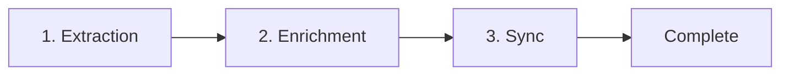

# Subcommand: pipeline <workflow> <tenant-env>

Run the complete pipeline: extraction → enrichment → sync.

## Arguments

- `workflow` - Spec folder name (e.g., `weekly-focus-queue`)
- `tenant-env` - Tenant and environment (e.g., `helpinghands-prod`)

## Pipeline Stages



| Stage | Command | Purpose |
|-------|---------|---------|
| Extraction | `/run-specs {workflow} {tenant}-{env}` | Pull data from Salesforce via MCP |
| Enrichment | `./scripts/devops/cli enrich {tenant}` | Add organizational context |
| Sync | `./scripts/devops/cli sync all {tenant}` | Upload to R2 for dashboard |

## Execution Steps

### Step 1: Parse Arguments

```
Input: weekly-focus-queue helpinghands-prod
  → workflow = weekly-focus-queue
  → tenant = helpinghands
  → env = prod
```

### Step 2: Validate Prerequisites

Before starting, verify:
1. **Workflow exists**: Check `mill/spec/{workflow}/manifest.json`
2. **Tenant configured**: Check `config/secrets/{tenant}/secrets.{env}`
3. **MCP reachable**: Health check the endpoint

If any prerequisite fails, report the error and stop.

### Step 3: Run Extraction

Invoke the `/run-specs` command:

```
/run-specs {workflow} {tenant}-{env}
```

Wait for completion. Gate check: if extraction fails, stop and report.

### Step 4: Run Enrichment

```bash
./scripts/devops/cli enrich {tenant}
```

Gate check: if enrichment fails, stop and report.

### Step 5: Run Sync

```bash
./scripts/devops/cli sync all {tenant}
```

### Step 6: Report Results

```
## Pipeline Complete

**Workflow**: weekly-focus-queue
**Tenant**: helpinghands (prod)

### Stages
| Stage | Status | Duration |
|-------|--------|----------|
| Extraction | ✅ Complete | 2m 30s |
| Enrichment | ✅ Complete | 45s |
| Sync | ✅ Complete | 15s |

### Outputs
- Extraction: dat/helpinghands/raw/weekly-focus-queue/{run_id}/
- Enriched: dat/helpinghands/enriched/
- R2: helpinghands-data bucket
```

## Error Handling

If any stage fails:

```
## Pipeline Failed

**Workflow**: weekly-focus-queue
**Tenant**: helpinghands (prod)

### Stages
| Stage | Status |
|-------|--------|
| Extraction | ✅ Complete |
| Enrichment | ❌ Failed |
| Sync | ⏭️ Skipped |

### Error
Enrichment failed: Missing persona file

### Recovery
1. Check dat/helpinghands/persona/ has required files
2. Re-run: resin pipeline weekly-focus-queue helpinghands-prod
```

## Local Development

For local testing:

```
resin pipeline 99-dev-test helpinghands-local
```

**Prerequisites:**
- Start local MCP: `cd workers/mcp/resin && npm run dev`
- Uses `config/secrets/helpinghands/secrets.local`
